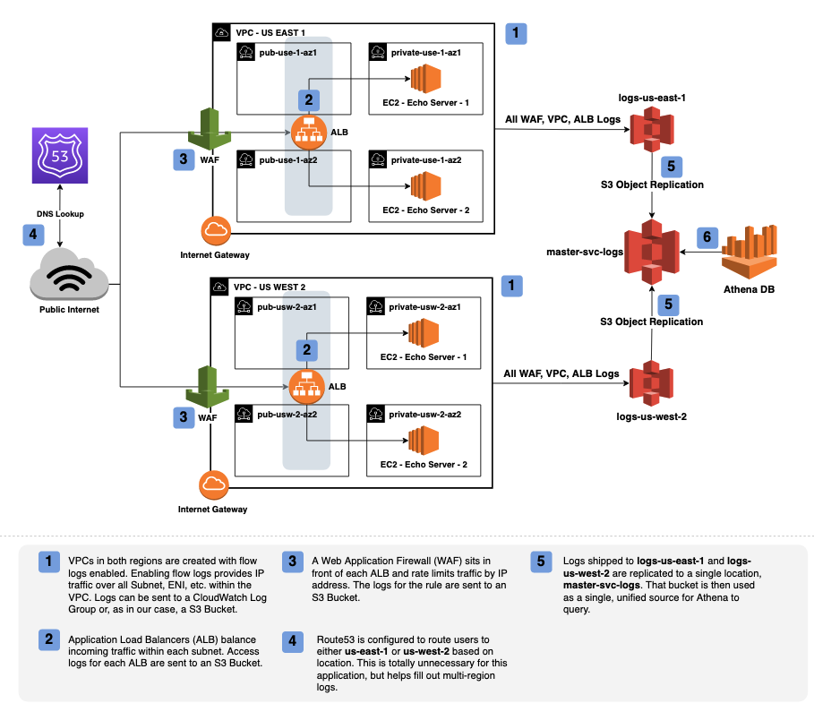

# Query Service Logs - Example Usage

This directory contains several examples for testing the associated terraform module. 

## Examples

The contents of `alb-*/**` contain examples handling a few different scenarios you might encounter when setting up service logs.

- [Automatic partitioning enabled](./alb-limited-partitions/main.tf) &mdash; Example uses `projected_partitioning` to remove the need fo manual maintenance of partitions.

- [Selective partitioning](./alb-limited-partitions/main.tf) &mdash; Example uses `organization_enabled_regions` to create a table that only queries against a particular region (e.g. `us-east-1` when `us-west-2` is also present in the bucket). You could use this pattern with `organization_account_ids` to limit the set accounts queried as well.
  
- [Automatic partitioning disabled](./alb-limited-partitions/main.tf) &mdash; If you'd like to manage partitions manually, you can disable projected partitioning.

- [Alternative Prefix](./alb-prefix/main.tf) &mdash; If your AWS service sinks logs to a location that is not the root of the folder, you should configure the storage location of your tables to reflect that.

## Echo Test Service

The contents of the `echo-sample-svc` directory launch a basic multi-region service that's been used to test this module with WAF, VPC, and ALB logs. You're free to launch these resources into your own account. Because the `echo-sample-svc` module configures WAF logs, it requires that you're already hosting a public [Route 53](https://docs.aws.amazon.com/Route53/latest/DeveloperGuide/CreatingHostedZone.html) on AWS that you're comfortable with using for testing (e.g. `*.test.yourdomain.com`).

***Be warned, this module launches live resources into multiple AWS regions. Be mindful to `terraform destroy` all resources once you're done to avoid any unexpected charges***.

At a high-level, `echo-sample-svc` launches steps **(1)**-**(5)** of the architecture shown below into your AWS account. Using the main module will then create the Athena resources to allow you to query service logs (**6**).

### Echo Service - Known Issues

- [Inconsistent Plan - Tags](https://github.com/hashicorp/terraform-provider-aws/issues/19583) &mdash; In some instances a `terraform apply` may yield

- The `echo` test service is configured to use a local backend, It's highly recommended that you modify the `terraform` block in `./svc_logs_sample/main.tf` to persist your state files remotely.
